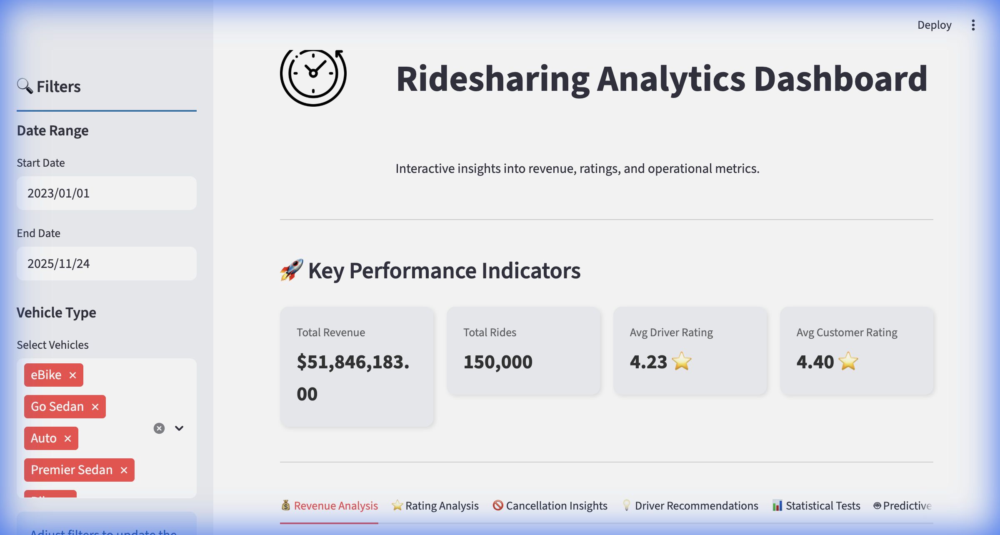
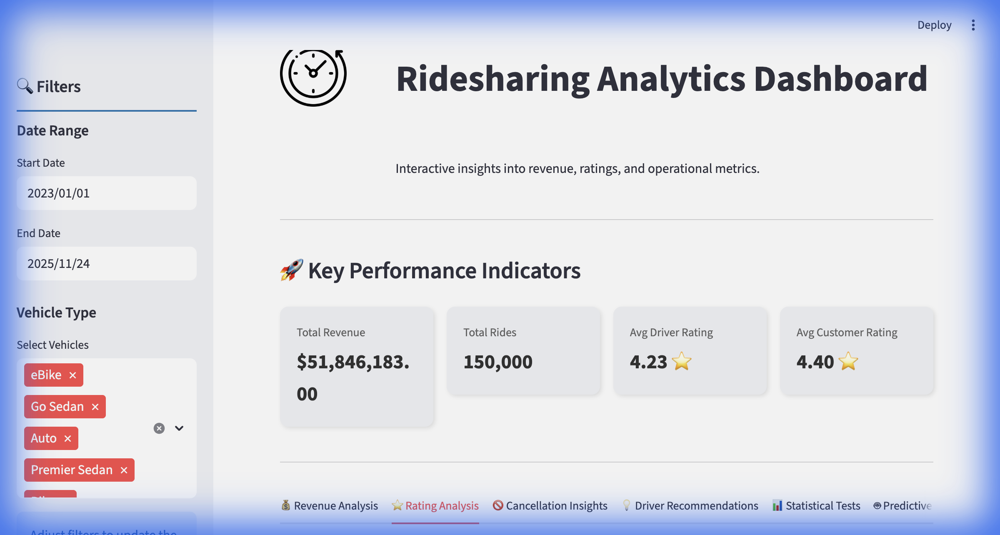
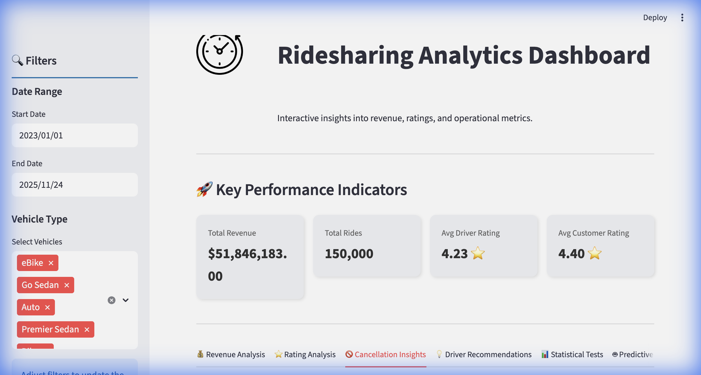
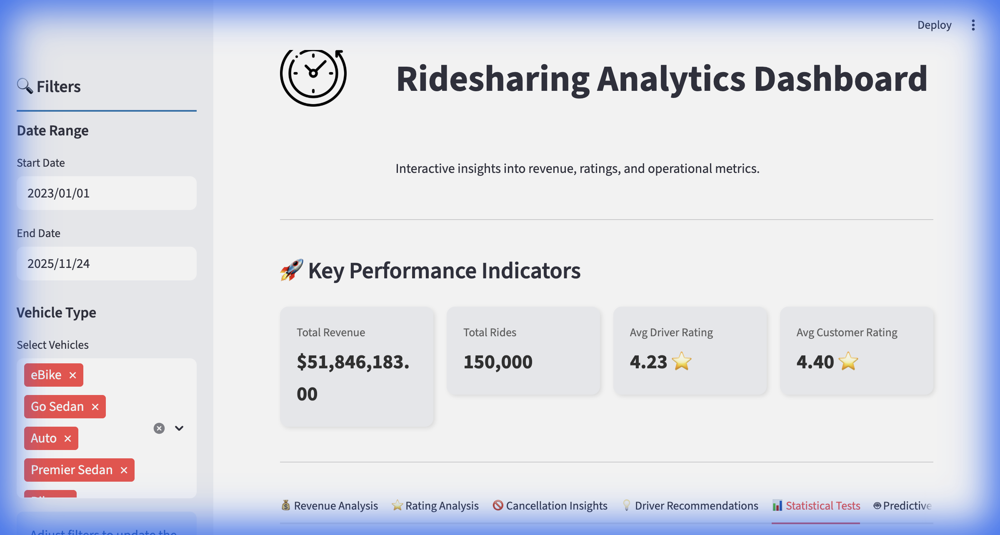
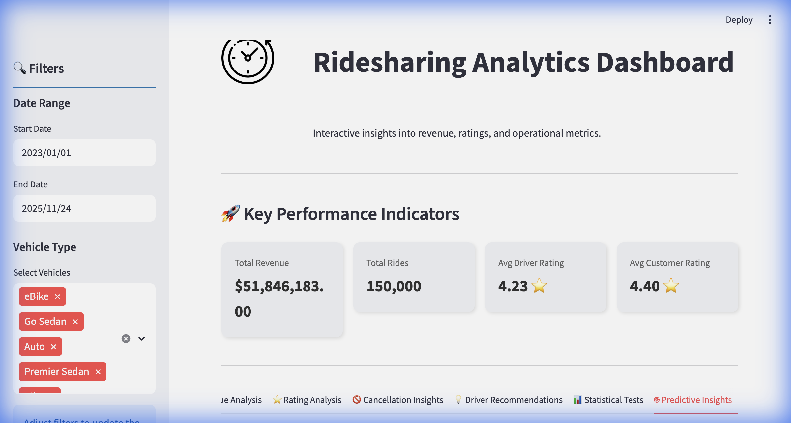

# 🚖 Ridesharing Analytics Dashboard

A production-grade analytics dashboard for ridesharing data, built with **FastAPI** (Backend) and **Streamlit** (Frontend). This application provides interactive insights into revenue, operational metrics, and predictive analytics using Machine Learning.



## 🚀 Features

### 1. 💰 Revenue Analysis
- **Revenue by Vehicle Type**: Breakdown of earnings across different vehicle categories.
- **Hourly Trends**: Analysis of revenue fluctuations throughout the day.
- **Distance Correlation**: Insights into how ride distance impacts revenue.
- **Payment Methods**: Revenue distribution by payment type.
- **Top Locations**: Identification of high-revenue pickup and drop-off zones.


### 2. ⭐ Rating Analysis
- **Rating Distribution**: Histogram of driver and customer ratings.
- **VTAT Impact**: Correlation between Vehicle Time to Arrival (VTAT) and ratings.
- **Customer Satisfaction**: Insights into factors affecting customer ratings.



### 3. 🚫 Cancellation Insights
- **Cancellation Rates**: Metrics on rides cancelled by customers vs. drivers.
- **Hourly Patterns**: When cancellations are most likely to occur.
- **Revenue Loss**: Estimated financial impact of cancellations.



### 4. 💡 Driver Recommendations
- **Actionable Insights**: AI-driven recommendations for drivers to improve ratings and earnings.
- **Performance Tips**: Best practices based on data analysis.


### 5. 📊 Statistical Hypothesis Testing
- **Rigorous Validation**: Statistical tests (T-tests, Chi-square) to validate business assumptions.
- **Significance Testing**: P-value analysis for revenue and rating hypotheses.



### 6. 🤖 Predictive Insights (ML)
- **Revenue Prediction**: Random Forest model to predict ride revenue ($R^2 \approx 0.05$).
- **Rating Prediction**: Classification model to predict driver ratings (Accuracy $\approx 92\%$).
- **Feature Importance**: Analysis of key drivers for revenue and ratings.



## 🛠️ Tech Stack

- **Backend**: FastAPI, Pandas, Scikit-learn
- **Frontend**: Streamlit, Plotly
- **Data**: 150,000+ ride records
- **ML**: Random Forest Regressor & Classifier

## ⚙️ Setup & Installation

### Prerequisites
- Python 3.9+
- pip

### 1. Clone the Repository
```bash
git clone https://github.com/AnupCloud/RideShare.git
cd RideShare
```

### 2. Create Virtual Environment
```bash
python -m venv .venv
source .venv/bin/activate  # On Windows: .venv\Scripts\activate
```

### 3. Install Dependencies
```bash
pip install -r requirements.txt
```
*(Note: If `requirements.txt` is missing, install manually: `pip install fastapi uvicorn streamlit pandas plotly scikit-learn requests`)*

### 4. Run the Application

**Option A: Run with Helper Script (Recommended)**
```bash
# Start both backend and frontend
./run_app.sh
```

**Option B: Run Manually**

Terminal 1 (Backend):
```bash
uvicorn src.backend.main:app --host 0.0.0.0 --port 8000
```

Terminal 2 (Frontend):
```bash
streamlit run src/frontend/app.py
```

## 📂 Project Structure

```
├── src/
│   ├── backend/
│   │   ├── main.py           # FastAPI entry point
│   │   ├── analytics.py      # Analytics logic
│   │   ├── ml_models.py      # Machine Learning models
│   │   ├── statistical_tests.py # Hypothesis testing
│   │   └── ...
│   ├── frontend/
│   │   ├── app.py            # Streamlit dashboard
│   │   ├── api_client.py     # API communication
│   │   └── ...
│   └── data/
│       └── ridesharing.csv   # Dataset
├── README.md                 # Documentation
└── ...
```

## ✅ Status

- [x] **Revenue Analysis**: Completed
- [x] **Rating Analysis**: Completed
- [x] **Cancellation Insights**: Completed
- [x] **Driver Recommendations**: Completed
- [x] **Statistical Tests**: Completed
- [x] **ML Models**: Completed (Revenue & Rating prediction)
- [x] **Documentation**: Completed

---
*Generated by Antigravity AI*
